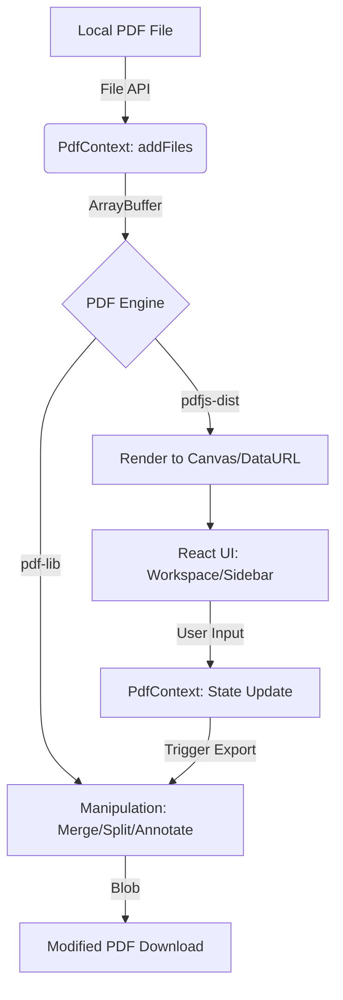

# Antigravity PDF - Technical Report

## 1. Project Overview
**Antigravity PDF** is a high-performance, premium desktop application designed for viewing and editing PDF documents. It leverages a modern web-tech stack within an Electron shell to provide a smooth, responsive, and aesthetically pleasing user experience.

### Key Features
- **High-Fidelity Rendering**: Utilizing PDF.js for accurate document visualization.
- **Dynamic Page Manipulation**: Real-time reordering, merging, and splitting of PDF pages.
- **Glassmorphism UI**: A premium dark-mode aesthetic with vibrant accents and smooth animations.
- **Batch Operations**: Advanced page selection and manipulation using range patterns.
- **Intelligent OCR Engine**: Automated scan detection and text recognition using Tesseract.js with real-time processing feedback.
- **Low-Latency Interactions**: Optimized for large documents with virtualization and caching.

---

## 2. Technology Stack

| Layer | Technology | Purpose |
| :--- | :--- | :--- |
| **Shell** | [Electron 35](https://www.electronjs.org/) | Cross-platform desktop environment. |
| **Frontend Framework** | [React 19](https://react.dev/) | Component-based UI and state management. |
| **Build Tool** | [Vite 8](https://vitejs.dev/) | Fast HMR and optimized production bundling. |
| **Language** | [TypeScript](https://www.typescriptlang.org/) | Static typing for reliability and maintainability. |
| **PDF Rendering** | [PDF.js (pdfjs-dist)](https://mozilla.github.io/pdf.js/) | High-fidelity canvas-based rendering. |
| **PDF Manipulation** | [pdf-lib](https://pdf-lib.js.org/) | Programmatic merging, splitting, and annotation. |
| **Styling** | Vanilla CSS | Custom design system using CSS Variables and Glassmorphism. |
| **Interactions** | [@hello-pangea/dnd](https://github.com/hello-pangea/dnd) | Robust drag-and-drop for page reordering. |

---

## 3. Project Structure & Modularity

The project follows a modular architecture, separating concerns between the Electron host, the PDF engine, and the UI components.

### Directory Tree
```text
.
├── electron/               # Electron main and preload scripts
├── src/
│   ├── features/           # Feature-based modules (Sidebar, Workspace, PDF Engine)
│   ├── shared/             # Reusable hooks, types, and utils
│   ├── context/            # Global state management (PdfContext)
│   ├── styles/             # Modular design system and CSS tokens
│   ├── index.css           # Global entry for styles
│   └── main.tsx            # Application entry point
├── vite.config.ts          # Build configuration
└── package.json            # Dependencies and scripts
```

### Modular Breakdown
- **`electron/`**: Handles window management and native OS integration.
- **`src/context/`**: The "Brain" of the app. Manages the state of loaded documents, page order, and selections.
- **`src/features/pdf-engine/`**: The "Engine". Abstracts complexity of PDF.js and pdf-lib into simple async functions.
- **`src/features/sidebar/`**, **`src/features/workspace/`**: The "Face". Independent feature units with their own components and styles.

---

## 4. Information & Data Pipeline

The following diagram illustrates how data flows from a local file to a rendered UI and eventually back to a modified PDF file.



### The "Page-First" Abstraction
Unlike traditional editors that treat a PDF as a single monolithic entity, Antigravity PDF decomposes documents into individual **Page Objects**. Each page is assigned a unique UUID, allowing it to be tracked and moved across the workspace regardless of its original document source.

---

## 5. User Interaction Flows

### Flow A: Document Ingestion
1. **Entry**: User lands on `UploadScreen`.
2. **Action**: Drag-and-drop or file selection.
3. **Process**: 
    - `PdfContext.addFiles` generates UUIDs for documents and pages.
    - `pdf.ts:loadPdfDocument` parses file into `pdfjsLib` proxy.
4. **Result**: Application transitions to editing mode; Sidebar populates with thumbnails.

### Flow B: Structural Manipulation (Reordering)
1. **Action**: User drags a page thumbnail in the `Sidebar`.
2. **Logic**: `@hello-pangea/dnd` tracks the movement.
3. **Update**: `PdfContext.setPages` updates the global array order. 
    - *Note*: If multiple pages are selected, they are moved as a cohesive block.
4. **Feedback**: `Workspace` instantly updates if the active page index shifted.

### Flow C: Batch Page Operations
1. **Action**: User types a pattern (e.g., `1-10, 15, 20-30`) in `PageRangeBar`.
2. **Parsing**: `usePageRangeParser` validates the string in real-time.
3. **Execution**: 
    - **Select**: Highlights matching pages.
    - **Remove**: Deletes matches from context.
    - **Keep Only**: Inverts selection and removes others.
4. **Preview**: `PageStrip` shows a mini-filmstrip of the affected pages.

### Flow D: Content Annotation
1. **Action**: (Planned/Limited) Dragging `DraggableText` onto the `Workspace` canvas.
2. **Logic**: `Workspace` maps screen coordinates to PDF coordinate space.
3. **State**: Annotations are stored in `PdfContext` and linked to specific `pageId`.

### Flow E: Production Export
1. **Action**: Click "Export PDF".
2. **Process**:
    - `pdf-lib` creates a new `PDFDocument`.
    - Iterates through the virtual `pages` array.
    - Copies original pages from source documents.
    - Overlays annotations using coordinate transformation.
3. **Delivery**: Browser triggers a download of the merged/modified Blob.

---

## 6. Code Analysis & Structural Health

During the project's evolution, several legacy functions were identified and **removed** in the recent restructuring to ensure a clean codebase:
- **`renderPageToCanvas`**: Removed. Superseded by the async priority queue in `useRenderEngine`.
- **`renderPageToDataUrl`**: Removed. Superseded by the thumbnail LRU cache (250 items).

### Structural Dependency Review
The project maintains a unidirectional data flow, but some components exhibit high complexity:

- **Circular Dependencies**: None detected. The separation of `PdfContextDef.ts` (interfaces) from `PdfContext.tsx` (implementation) prevents common React context circularity.
- **Complexity Hotspots**:
    - **`Sidebar.tsx`**: Combines virtual scrolling (for 1000+ page docs) with complex drag-and-drop logic. It is the most "fragile" component due to the intersection of these two libraries.
    - **`useRenderEngine.ts`**: Implements a custom scheduler to manage PDF.js rendering tasks. While robust, it introduces significant non-React logic into the hook layer.
- **Dependency Tree**:
    - `App` -> `PdfProvider` -> `Sidebar` / `Workspace`.
    - Components -> `usePdf` (shared) / `useRenderEngine` (pdf-engine) -> `PdfContext`.
    - `PdfContext` -> `pdf-engine/utils.ts` -> `pdfjs-dist` / `pdf-lib`.

---

## 7. Implementation Choices

### Hybrid PDF Engine
The app uses two different libraries for PDF handling to get the best of both worlds:
1. **PDF.js** is used for **rendering**. It is the gold standard for web-based PDF viewing but lacks robust editing capabilities.
2. **pdf-lib** is used for **structural changes**. It is extremely efficient at modifying PDF structures (merging pages, adding text) but doesn't provide a visual renderer.

### State Management: React Context vs. Redux
Given the document-centric nature of the app, **React Context** was chosen for its simplicity and deep integration with React Hooks. The `PdfProvider` acts as a centralized store for all document-related data, ensuring high-performance updates without the boilerplate of Redux.

### Aesthetics & Performance
- **CSS Variables**: Used extensively to maintain a consistent theme and allow for easy future skinning (e.g., Light Mode).
- **Virtualization**: Large document support is achieved by only rendering pages visible in the viewport (implemented in Sidebar and Workspace).
- **Worker Loading**: PDF.js workers are loaded via a separate thread to ensure the UI remains responsive during heavy rendering tasks.
- **Progressive OCR Pipeline**: Scanned pages are automatically identified. The OCR engine uses a parallel worker pool (`navigator.hardwareConcurrency`-aware, up to 4 threads) via Tesseract.js's scheduler to process multiple pages concurrently. Batch OCR runs entirely off-screen — pages are rendered to off-screen canvases at 2× resolution and sent to the worker pool, allowing users to freely navigate the document during processing. The batch pipeline includes a **lightweight language detection step** that samples the first page's text and performs stop-word frequency analysis to automatically load secondary language models (e.g., Italian, French, Spanish) alongside English. The batch is cancellable with an option to keep partial results. Text is grouped at the line level (not word level) so that copied text includes proper spacing. The text layer uses a dual-container architecture separating PDF.js native text from React-managed OCR overlays.
- **Multi-input Zoom**: Zoom is supported via the UI slider, Ctrl+scroll (mouse wheel), and trackpad pinch-to-zoom gestures.

---

## 8. Mathematical Foundations (Annotations)
The coordinate system for annotations requires mapping between the **Browser Viewport** (Top-Left origin) and the **PDF Coordinate Space** (Bottom-Left origin).

The transformation for a point $(x, y)$ in the viewer to $(x', y')$ in the PDF is:

$$x' = \frac{x}{scale}$$
$$y' = Height_{PDF} - \frac{y}{scale} - \frac{FontSize_{scaled}}{scale}$$

*Where $scale$ is the zoom level used during the annotation placement.*

---

## 9. Future Roadmap
- [ ] **Advanced Annotations**: Support for shapes, highlights, and images.
- [ ] **Cloud Sync**: Optional integration with cloud storage providers.
- [ ] **Plugin System**: Modular extensions for specialized PDF workflows.
